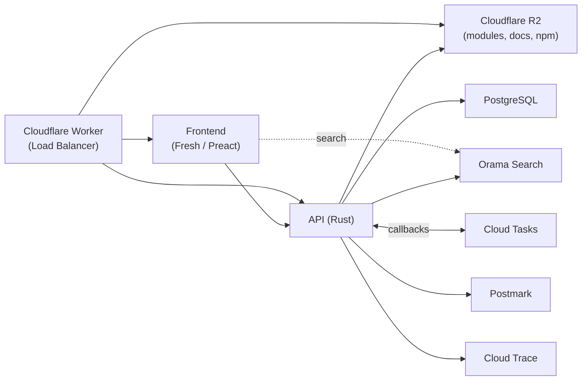

# Architecture

This document describes the high-level architecture of jsr.io, the JavaScript
registry. It is intended for both contributors looking to understand the
codebase and users curious about how the system works.

## Overview

jsr.io is composed of four main components:

1. **API** — a Rust backend that handles all business logic
2. **Frontend** — a Fresh (Deno + Preact) server-rendered web application
3. **Load Balancer** — a Cloudflare Worker that routes requests
4. **Database** — PostgreSQL for metadata storage

Module source code, generated documentation, and npm compatibility tarballs are
stored in Cloudflare R2 (S3-compatible object storage). The database is _not_
used for serving registry requests — it only stores metadata and user data.



## Request Routing

The Cloudflare Worker in `lb/` is the entry point for all traffic. It inspects
the hostname and path to route each request:

| Request                                                      | Routed to          |
| ------------------------------------------------------------ | ------------------ |
| `api.jsr.io/*`                                               | Cloud Run API      |
| `jsr.io/api/*`                                               | Cloud Run API      |
| `npm.jsr.io/*`                                               | R2 npm bucket      |
| `jsr.io/@scope/pkg/meta.json`, `jsr.io/@scope/pkg/version/*` | R2 modules bucket  |
| Everything else on `jsr.io`                                  | Cloud Run Frontend |

The worker also handles CORS, security headers (including a strict Content
Security Policy for module files), bot detection for SEO, and download analytics
via the Cloudflare Analytics Engine.

## API (`api/`)

The API is a Rust HTTP server built with Hyper and Routerify. It is the single
source of truth for all write operations and business logic.

### Directory Structure

```
api/
├── src/
│   ├── main.rs              # Entry point, server setup
│   ├── config.rs            # Environment variable configuration
│   ├── api/                 # HTTP endpoint handlers
│   │   ├── package.rs       # Package queries, versions, dependencies
│   │   ├── scope.rs         # Scope management, members, invites
│   │   ├── admin.rs         # Staff-only administration
│   │   ├── authorization.rs # OAuth token management
│   │   ├── self_user.rs     # Current user account
│   │   ├── types.rs         # Request/response types
│   │   └── errors.rs        # Error definitions
│   ├── auth/                # OAuth handlers (GitHub, GitLab)
│   ├── db/                  # Database models and queries (sqlx)
│   ├── publish.rs           # Publishing pipeline
│   ├── tarball.rs           # Tarball processing
│   ├── npm/                 # NPM compatibility tarball generation
│   ├── docs.rs              # Documentation generation (deno_doc)
│   ├── analysis.rs          # Code analysis
│   ├── external/            # External service clients (Cloudflare, Orama)
│   ├── emails/              # Email templates (Postmark)
│   ├── iam.rs               # Permissions and access control
│   ├── ids.rs               # Type-safe identifiers
│   ├── provenance.rs        # Package provenance verification
│   ├── s3.rs                # R2/S3 storage operations
│   ├── task_queue.rs        # Rate-limited background job queue
│   ├── tasks.rs             # Background task handlers
│   └── tracing.rs           # OpenTelemetry setup
├── macros/                  # Procedural macros
├── migrations/              # SQL migration files (sqlx)
└── Cargo.toml
```

### Key Responsibilities

- **Authentication**: OAuth 2.0 with GitHub and GitLab. Sessions are managed via
  JWTs and stored in the database.
- **Publishing**: Receives tarballs from `deno publish`, validates metadata and
  files, uploads to R2, generates documentation, and indexes in Orama.
- **Package management**: CRUD operations for scopes, packages, versions, and
  members.
- **NPM compatibility**: Generates npm-compatible tarballs so JSR packages can
  be consumed by npm, yarn, and pnpm.
- **Search indexing**: Pushes package metadata, symbols, and documentation to
  Orama for full-text search.
- **Background tasks**: Long-running work (publishing, npm tarball generation)
  is queued via Google Cloud Tasks and processed asynchronously.

### Key Dependencies

- **sqlx** — compile-time verified SQL queries against PostgreSQL
- **hyper + routerify** — HTTP server and routing
- **deno_doc / deno_ast / deno_graph** — documentation generation and dependency
  analysis
- **rust-s3** — Cloudflare R2 / S3 integration
- **tree-sitter** — syntax highlighting for source code
- **opentelemetry** — distributed tracing
- **jemalloc** — memory allocator (with profiling support)

## Frontend (`frontend/`)

The frontend is a [Fresh](https://fresh.deno.dev/) application using Preact and
Tailwind CSS. It uses Fresh's
[islands architecture](https://fresh.deno.dev/docs/concepts/islands) — pages are
server-rendered by default, and only interactive components ("islands") ship
JavaScript to the browser.

### Directory Structure

```
frontend/
├── routes/                 # File-based routing
│   ├── _app.tsx            # Root layout
│   ├── _middleware.ts      # Auth and request context
│   ├── index.tsx           # Homepage
│   ├── packages.tsx        # Package search/list
│   ├── @[scope]/           # Scope pages (dynamic route)
│   ├── package/            # Package detail, docs, versions, source
│   ├── account/            # User account settings, tokens, invites
│   ├── admin/              # Staff admin dashboard
│   ├── docs/               # Registry documentation
│   └── publishing/         # Publish status tracking
├── islands/                # Interactive Preact components
│   ├── GlobalSearch.tsx    # Search bar with Orama
│   ├── UserMenu.tsx        # User dropdown
│   ├── CopyButton.tsx      # Click-to-copy
│   └── ...
├── components/             # Server-rendered components
│   ├── doc/                # Documentation rendering
│   ├── Header.tsx
│   ├── PackageHit.tsx
│   └── ...
├── docs/                   # Markdown documentation content
├── utils/                  # Shared utilities
├── static/                 # Static assets (images, CSS)
└── deno.json
```

### Key Features

- **Server-side rendering** for fast initial loads and SEO
- **Islands architecture** — only interactive components are hydrated in the
  browser
- **Orama search** — client-side full-text search with highlighting
- **Documentation rendering** — HTML docs generated by the API are displayed
  with breadcrumb navigation and symbol search
- **Dark mode** support via Tailwind

## Load Balancer (`lb/`)

A Cloudflare Worker that acts as the edge router. See
[Request Routing](#request-routing) above for the routing table.

Key files:

- `main.ts` — request routing logic
- `proxy.ts` — proxy to Cloud Run and R2 backends
- `headers.ts` — security headers, CORS, CSP
- `bots.ts` — bot/crawler detection
- `analytics.ts` — download tracking
- `local.ts` — local development server (used by `deno task dev`)

## Database

PostgreSQL stores all metadata. Module source files are _not_ stored in the
database — they live in R2.

### Core Tables

| Table                          | Purpose                                             |
| ------------------------------ | --------------------------------------------------- |
| `users`                        | User accounts (linked to GitHub/GitLab via OAuth)   |
| `scopes`                       | Package namespaces (e.g., `@std`)                   |
| `scope_members`                | Scope ownership and membership                      |
| `packages`                     | Package metadata within a scope                     |
| `package_versions`             | Published versions with semver sorting              |
| `package_files`                | File manifest (paths, sizes, checksums) per version |
| `package_version_dependencies` | Dependency graph (jsr, npm, node, http)             |
| `publishing_tasks`             | Tracks publish jobs through their lifecycle         |
| `npm_tarballs`                 | NPM compatibility tarball records                   |
| `authorizations`               | OAuth tokens and personal access tokens             |
| `download_counts`              | JSR and npm download metrics                        |
| `audit_log`                    | Administrative action history                       |
| `support_tickets`              | User support tickets and messages                   |

Migrations are in `api/migrations/` and managed by sqlx. Version columns use
natural collation so `1.10.0` sorts after `1.9.0`.

## Storage (Cloudflare R2)

Four R2 buckets hold all published artifacts:

| Bucket       | Contents                                    |
| ------------ | ------------------------------------------- |
| `publishing` | Temporary tarball uploads during publish    |
| `modules`    | Published package source files and metadata |
| `docs`       | Generated HTML documentation                |
| `npm`        | NPM compatibility tarballs                  |

The `modules` bucket is served directly through the Cloudflare Worker with
strict access controls — browsers cannot navigate directly to untrusted source
files (they must use appropriate HTTP headers).

## Publishing Flow

This is the core workflow of the registry:

1. A user runs `deno publish` (or uses CI).
2. The CLI packages the source into a tarball and POSTs it to the API.
3. The API validates authorization, metadata (`deno.json`), and file contents.
4. A `publishing_task` record is created with status `pending`.
5. The task is queued to Google Cloud Tasks.
6. A background worker picks it up and:
   - Extracts files from the tarball
   - Uploads source files to the `modules` R2 bucket
   - Generates documentation via `deno_doc` and uploads to the `docs` bucket
   - Analyzes dependencies
   - Updates the database
   - Optionally generates an NPM compatibility tarball
   - Indexes the package in Orama for search
7. The CLI polls the publishing task endpoint until it succeeds or fails.

## Search

Search is powered by [Orama](https://orama.com/) with three indexes:

- **Packages** — package name, scope, description
- **Symbols** — exported functions, types, interfaces, classes
- **Documentation** — full-text documentation content

The API pushes updates to Orama on each publish. The frontend queries the Orama
public API directly from the browser for instant results.

## Infrastructure

Infrastructure is managed with Terraform across two configurations:

- `terraform/` — main infrastructure (Cloud Run, Cloud SQL, R2 buckets, Cloud
  Tasks, load balancer, secrets)
- `terraform_infra/` — CI/CD setup (GitHub Actions OIDC, Artifact Registry,
  service accounts)

### Production Deployment

- **API**: Google Cloud Run, `us-central1`
- **Frontend**: Google Cloud Run, `us-central1`
- **Database**: Google Cloud SQL (PostgreSQL, high availability)
- **Job queues**: Google Cloud Tasks (publishing, npm tarball builds)
- **Analytics**: BigQuery (download metrics)
- **Tracing**: Google Cloud Trace (OpenTelemetry)
- **Email**: Postmark
- **CDN/Edge**: Cloudflare (Worker + R2 + Cache)

## Local Development

The `deno task dev` command (implemented in `tools/dev.ts`) starts the full
stack locally:

1. **PostgreSQL** — via Docker or native install
2. **MinIO** — S3-compatible storage (stands in for R2)
3. **Jaeger** — distributed tracing UI at `http://localhost:16686`
4. **Load Balancer** — the Cloudflare Worker running locally via Deno
5. **API** — the Rust server via `cargo run`
6. **Frontend** — the Fresh dev server

Local hostnames (`jsr.test`, `api.jsr.test`, `npm.jsr.test`) are configured in
`/etc/hosts` by `deno task dev setup`.

## Tools (`tools/`)

| Script                       | Purpose                                                        |
| ---------------------------- | -------------------------------------------------------------- |
| `dev.ts`                     | Multi-process development orchestrator                         |
| `prod_proxy.ts`              | Proxy for frontend-only development against the production API |
| `orama_packages_reindex.ts`  | Reindex packages in Orama                                      |
| `orama_symbols_reindex.ts`   | Reindex symbols in Orama                                       |
| `orama_docs_reindex.ts`      | Reindex documentation in Orama                                 |
| `generate_global_symbols.ts` | Generate Deno global type definitions                          |
| `generate_web_symbols.ts`    | Generate web API type definitions                              |
| `clone_dependency.ts`        | Clone dependencies for offline development                     |
| `migrate_package_meta.ts`    | Database migration utilities                                   |

## E2E Tests (`e2e/`)

End-to-end tests run against staging or production using `deno test`. They cover
authentication flows, package publishing, scope management, and API contracts.

```sh
deno task e2e:staging   # run against staging
deno task e2e:prod      # run against production
```
